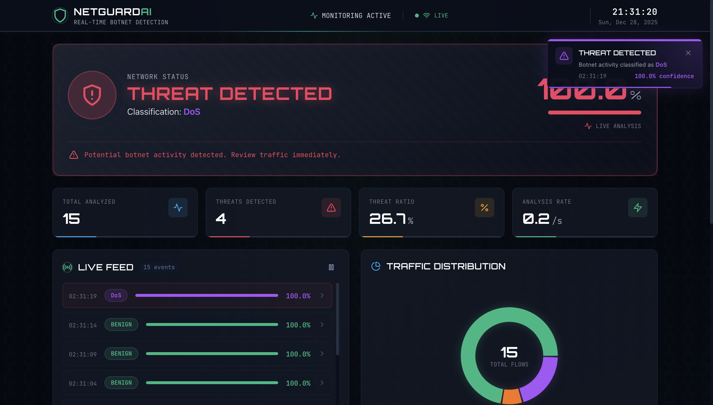

# 🛡️ NetGuard AI - Real-Time Botnet Detection Dashboard

A professional, real-time dashboard for visualizing ML-based network traffic classification. Built with React, Tailwind CSS, and Recharts.



## ✨ Features

- **Real-Time Classification Feed**: Live stream of network traffic classifications
- **Threat Status Hero**: Instant visual feedback on network security status
- **Interactive Charts**: Donut chart for distribution, area chart for timeline
- **Alert System**: Toast notifications for detected threats
- **Responsive Design**: Works on desktop, tablet, and mobile
- **Dark Theme**: Eye-friendly security operations center aesthetic
- **Mock Data Mode**: Demo data for testing without backend

## 📊 Dataset

This project uses the **CICIDS2017** and **CSE-CIC-IDS2018** datasets from the Canadian Institute for Cybersecurity. These are widely used benchmark datasets for network intrusion detection research.

### Dataset Links
- [CICIDS2017](https://www.unb.ca/cic/datasets/ids-2017.html)
- [CSE-CIC-IDS2018](https://www.unb.ca/cic/datasets/ids-2018.html)

### Attack Classes
| Class | Description |
|-------|-------------|
| BENIGN | Normal, non-malicious traffic |
| DDoS | Distributed Denial of Service attacks |
| DoS | Denial of Service attacks |
| Bot | Botnet traffic |
| Port Scan | Network reconnaissance attacks |
| Brute Force | Password/authentication attacks |
| Web Attack | SQL injection, XSS, etc. |

## 🧠 Model Pipeline

### 1. Feature Selection with PCA
The original dataset contains 80+ network flow features. We applied Principal Component Analysis (PCA) to reduce dimensionality while retaining maximum variance. The top 35 principal components were selected, capturing the most significant patterns in network traffic behavior.

### 2. Class Balancing with GANs
The original dataset was heavily imbalanced — BENIGN traffic dominated while attack classes were underrepresented. We used Generative Adversarial Networks (GANs) to synthetically upsample minority classes, creating a balanced dataset that prevents the model from being biased toward the majority class.

### 3. Hybrid KNN + Random Forest Model
We built a hybrid classifier combining two complementary algorithms:

- **K-Nearest Neighbors (KNN)**: k=3, using ball_tree algorithm for efficient neighbor search. KNN captures local patterns and is effective for identifying similar attack signatures.

- **Random Forest (RF)**: 90 decision trees with random_state=42. RF captures global patterns and provides robust classification through ensemble voting.

These models are combined using a **Soft Voting Classifier**, which averages the predicted probabilities from both models rather than just counting votes. This approach leverages the strengths of both algorithms — KNN's instance-based learning and RF's feature-based decision boundaries.

### 4. Cross-Validation Results
The model was evaluated using 5-fold cross-validation:

| Fold | Accuracy |
|------|----------|
| 1 | 99.76% |
| 2 | 99.75% |
| 3 | 99.75% |
| 4 | 99.77% |
| 5 | 99.76% |
| **Mean** | **99.76%** |

### 5. Interpretability with SHAP & LIME
To make predictions interpretable and reduce false positives, we implemented:

- **SHAP (SHapley Additive exPlanations)**: Provides global feature importance and explains how each feature contributes to individual predictions. Helps identify which network flow characteristics are most indicative of attacks.

- **LIME (Local Interpretable Model-agnostic Explanations)**: Generates local explanations for individual predictions, helping security analysts understand why a specific flow was classified as malicious.

These interpretability tools are crucial for real-world deployment — security teams can verify predictions rather than blindly trusting the model, significantly reducing false positive fatigue.

## 🚀 Quick Start

### Prerequisites

- Node.js 18+ installed
- npm or yarn

### Installation

1. **Clone or download this folder**

2. **Install dependencies**
```bash
   cd botnet-dashboard
   npm install
```

3. **Start development server**
```bash
   npm run dev
```

4. **Open in browser**
```
   http://localhost:5173
```

The dashboard will start in **Demo Mode** with simulated data, so you can see it working immediately!

## 🔧 Configuration

### Connecting to Your Backend

Update `.env.local` with your Hugging Face Space URL:
```
   VITE_API_URL=https://your-username-botnet-detector.hf.space
```

### Customizing Class Names

If your botnet classes are different, update `CLASS_COLORS` in `src/App.jsx`:
```javascript
export const CLASS_COLORS = {
  'BENIGN': '#10b981',
  'Port Scan': '#f43f5e',
  'DDoS': '#f97316',   
  'DoS': '#a855f7',
  'Bot': '#06b6d4', 
  'Brute Force': '#ec4899',
  'Web Attack': '#eab308',
}
```

## 📦 Deployment to Vercel

### Option 1: Vercel CLI
```bash
npm install -g vercel
vercel
```

### Option 2: GitHub Integration

1. Push this folder to a GitHub repository
2. Go to [vercel.com](https://vercel.com)
3. Import your repository
4. Add environment variable:
   - Name: `VITE_API_URL`
   - Value: Your Hugging Face Space URL
5. Deploy!

## 📁 Project Structure
```
botnet-dashboard/
├── public/
│   └── shield.svg          # Favicon
├── src/
│   ├── components/
│   │   ├── Header.jsx      # Top navigation bar
│   │   ├── ThreatHero.jsx  # Main threat status display
│   │   ├── StatsCards.jsx  # Statistics cards row
│   │   ├── LiveFeed.jsx    # Real-time classification feed
│   │   ├── DistributionChart.jsx  # Donut chart
│   │   ├── TimeSeriesChart.jsx    # Timeline area chart
│   │   ├── AlertToast.jsx  # Threat alert notifications
│   │   └── Footer.jsx      # Footer with status
│   ├── App.jsx             # Main application component
│   ├── main.jsx            # Entry point
│   └── index.css           # Global styles
├── index.html
├── package.json
├── tailwind.config.js
├── vite.config.js
└── README.md
```

## 🎨 Customization

### Colors

Edit `tailwind.config.js` to change the color palette:
```javascript
colors: {
  benign: '#10b981',    // Safe traffic (green)
  threat: '#f43f5e',    // Threats (red)
  warning: '#f59e0b',   // Warnings (amber)
  info: '#0ea5e9',      // Info (blue)
}
```

### Fonts

The dashboard uses three fonts:
- **Orbitron**: Display/headings (futuristic)
- **JetBrains Mono**: Monospace/data
- **Exo 2**: Body text

Change in `index.html` and `tailwind.config.js` if desired.

### Polling Interval

Adjust how often the dashboard fetches new data in `src/App.jsx`:
```javascript
const pollInterval = setInterval(async () => {
  // ...
}, 5000) // Change this value for polling interval (milliseconds)
```

## 🔌 API Integration

The dashboard expects these endpoints from your backend:

### GET /predict

Returns the next traffic classification:
```json
{
  "id": "unique-id",
  "timestamp": "2024-01-01T12:00:00Z",
  "prediction": "BENIGN",
  "confidence": 0.95,
  "probabilities": {
    "BENIGN": 0.95,
    "Port Scan": 0.02,
    "DDoS": 0.01,
    ...
  }
}
```

### GET /health

Simple health check (returns 200 OK)

## 🐛 Troubleshooting

**Dashboard shows "Connecting..." forever**
- Check if backend URL is correct in `.env.local`
- Ensure backend has CORS enabled for your Vercel domain

**Charts not showing data**
- Wait a few seconds for data to accumulate
- Check browser console for errors

**Styles look broken**
- Run `npm install` again
- Clear browser cache

## 📄 License

MIT License - feel free to use for your projects!

---
